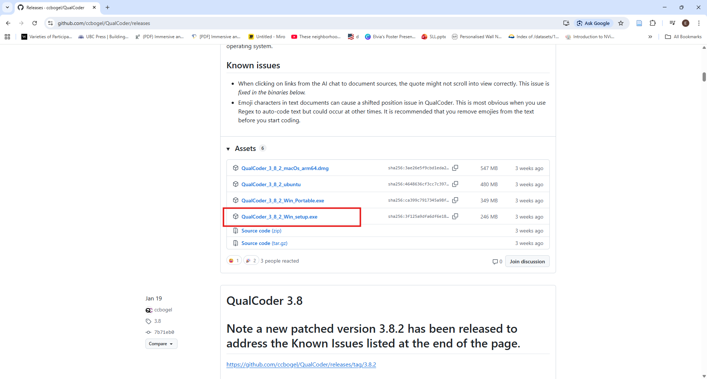
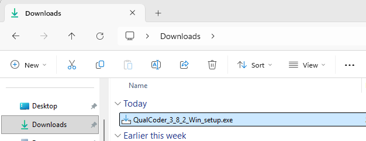
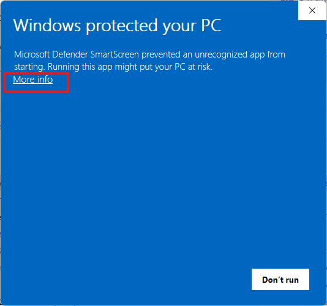
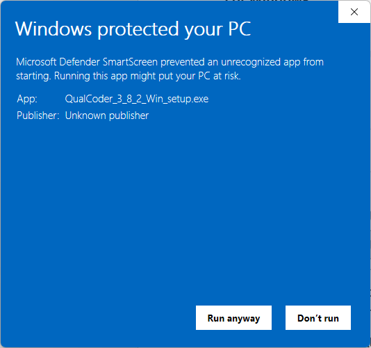
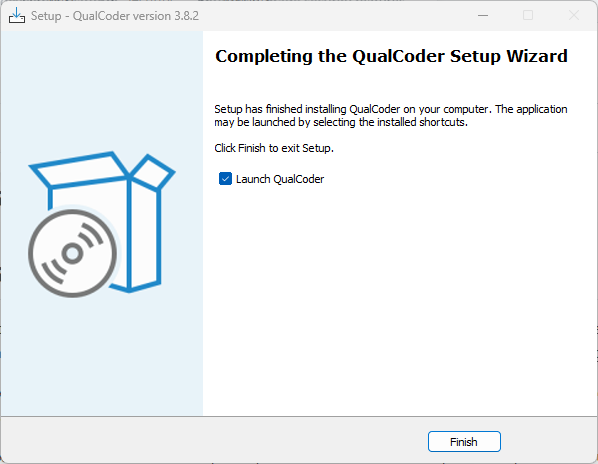
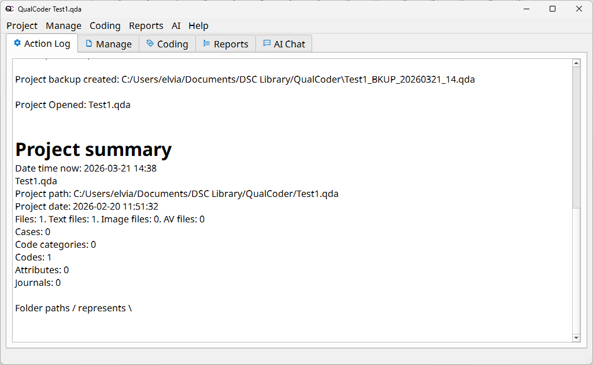

# Installation and Setup 

## A. Step 1: Download QualCoder

1.	Go to the official [QualCoder GitHub repository](https://github.com/ccbogel/QualCoder/releases){:target="_blank"} 
2.	Scroll down to the latest version (version 3.8.2)
3.	Download the appropriate file for your operating system: 
    - Windows: .exe file (e.g. QualCoder_3_8_2_setup.exe file)
 

## B.  Step 2: Install the Software
1.	Double-click the downloaded .exe file 
 
2.	A “Windows protected your PC” message may appear. This is a standard security warning for applications downloaded from the internet. 
 
3.	Click “More info”, then click “Run anyway”
 
4.	Follow the installation prompts
 
5.	Once installed, launch QualCoder
 

## C. Settings in QualCoder

Before starting your analysis, it is helpful to configure a few basic settings in QualCoder. These settings ensure that your work is properly tracked and that the interface is comfortable to use.\

1. Set the Coder Name. QualCoder assigns a coder name to every code you apply. This is useful for tracking who performed the coding. 
    - Go to **Project > Settings**
    - In the **Current coder** field, click on the **Change** button (beside **Current Coder**).
    - In the **Coders** dialog box:
        -   Click New
        - 	Enter your name or initial
        - 	Click OK
    - Select your name or initial in the Coder dialogue box and click OK 
2. Configure Language and Appearance. You can adjust the interface to suit your preferences.
•	Options:
•	Select your preferred language (e.g., English, Spanish, French, German, Italian) 
•	Adjust font type and size for better readability
3. Manage Backups and Performance. These settings help ensure your project runs smoothly and your data is protected.
•	Backups. Ensure that backups are enabled in Settings to prevent data loss 
•	Project Directory. Choose a folder on your local drive for storing projects
•	Important: Avoid running QualCoder projects directly from cloud-synced folders (e.g., OneDrive or Dropbox), as this may corrupt the database.
•	Default Fragment Size (for large files) If your computer is slower or your files are large: 
o	Reduce the fragment size (default: 50,000 characters) 
o	This allows files to load in smaller sections

 

- **MAKE SURE to title the next and following activities** in the following format: "**1-Next Activity**" & "**2-Second Activity**".
- **UPDATE LINKS** Please review the following [Introductory Slides](https://docs.google.com/presentation/d/1hjgyXWqlEb3NijemjMQwqBDszmIAMjI3TJn58lE0Mm8/edit#slide=id.g7d261d3503_1_0){:target="_blank"} or [Workshop Introduction Video](https://www.youtube.com/watch?v=0LHKWZ18UEc){:target="_blank"}

**UPDATE**
[NEXT STEP: Excel Basics](basics-data-cleaning.html){: .btn .btn-blue }
