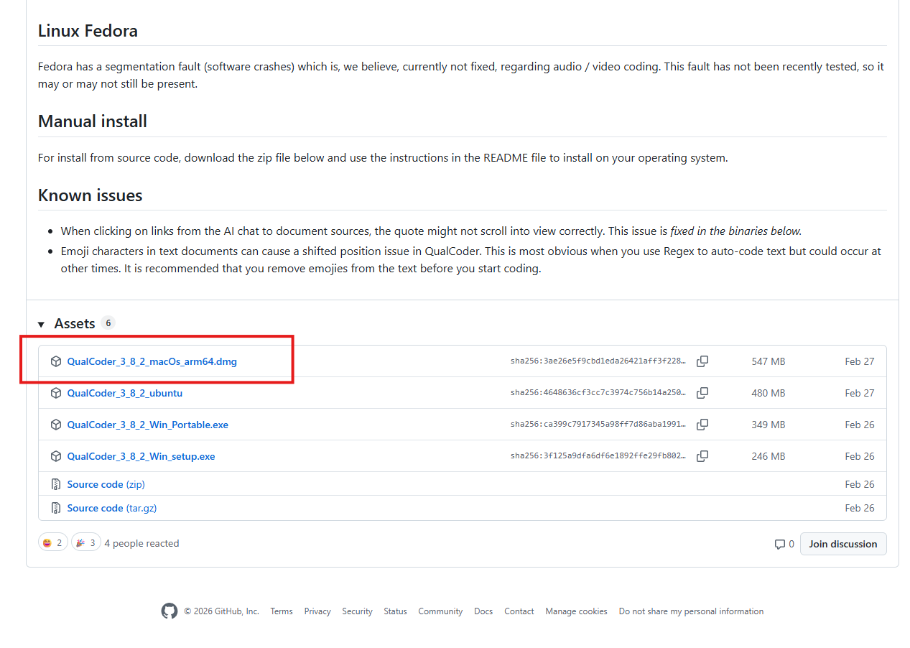
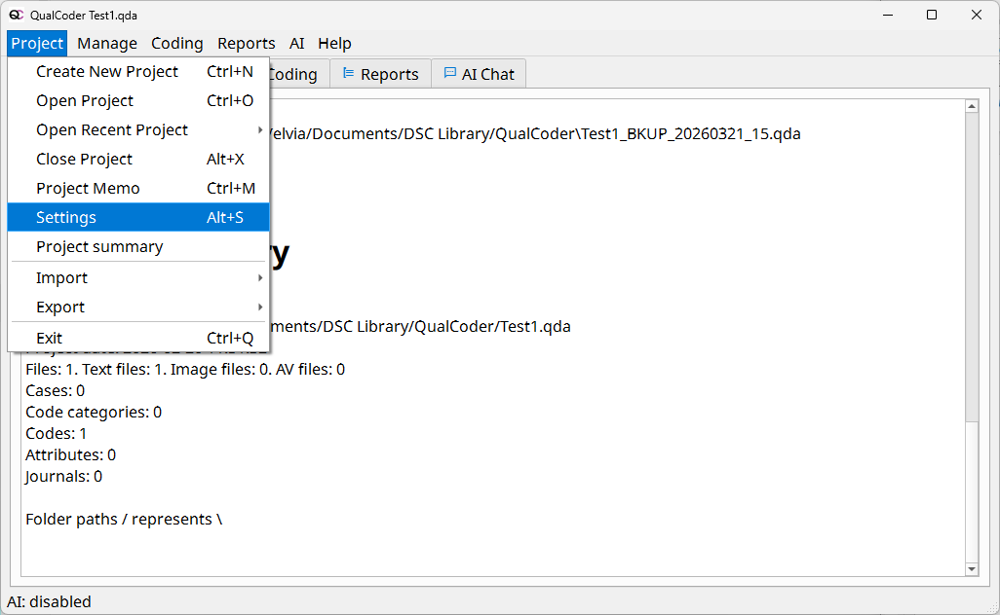
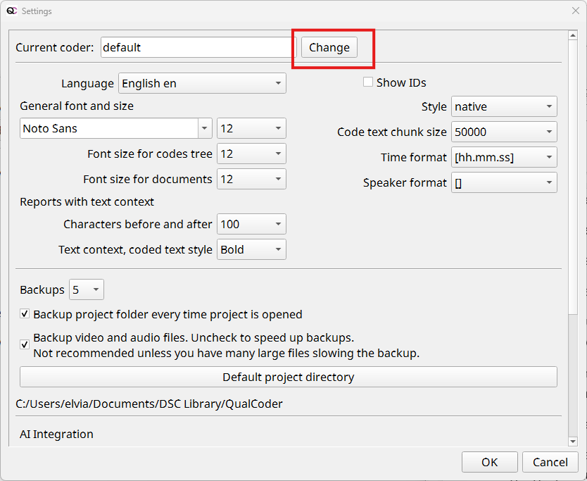
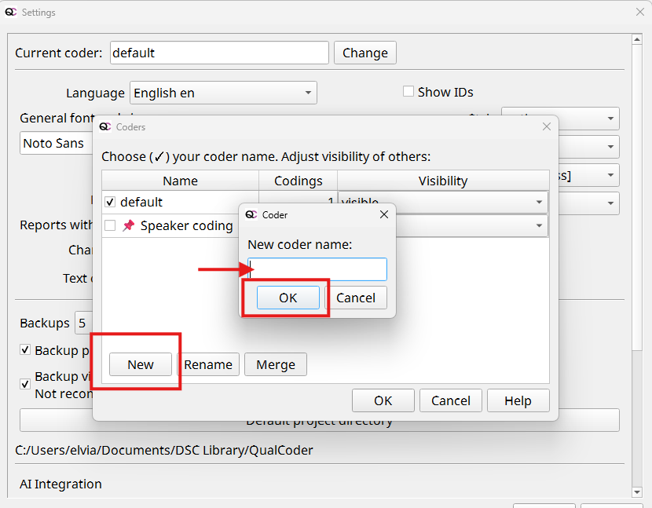
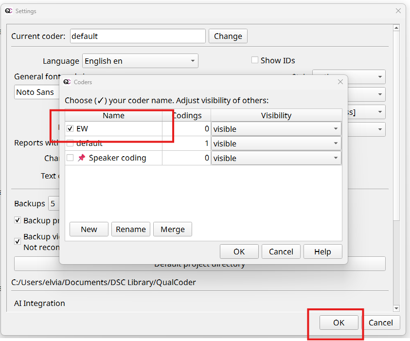
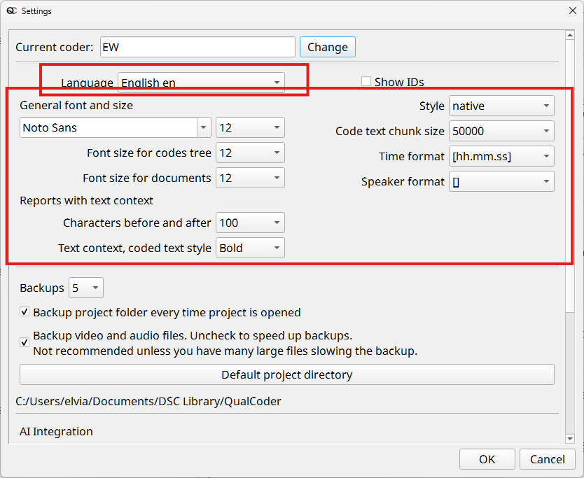
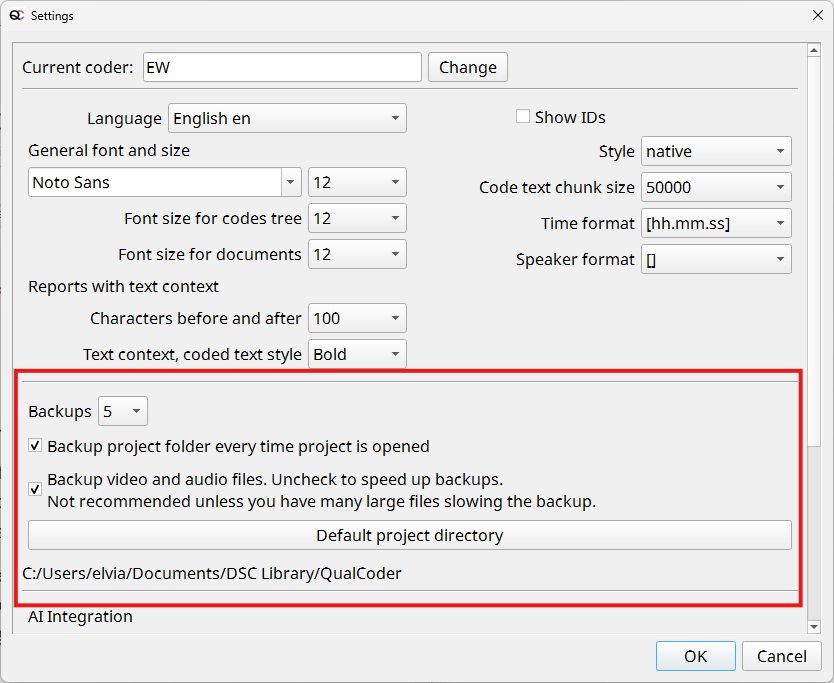

# Installation and Setup 

## A. Step 1: Download QualCoder

1.	Go to the official [QualCoder GitHub repository](https://github.com/ccbogel/QualCoder/releases){:target="_blank"} 
2.	Scroll down to the latest version (version 3.8.2)
3.	Download the appropriate file for your operating system: 
    - macOS: .dmg file (e.g. QualCoder_3_8_2_macOs_arm64.dmg file)
 

## B.  Step 2: Install the Software
1.	Open the .dmg file 
[Screenshot]
2.	Drag QualCoder into the Applications folder 
3.	If the software is blocked, go to: 
  - System Settings → Privacy & Security 
  - Click “Open Anyway” 
4. Follow the installation prompts
5. Once installed, launch QualCoder

## C. Settings in QualCoder

Before starting your analysis, it is helpful to configure a few basic settings in QualCoder. These settings ensure that your work is properly tracked and that the interface is comfortable to use.\

1. **Set the Coder Name.** QualCoder assigns a coder name to every code you apply. This is useful for tracking who performed the coding. 
    - Go to **Project > Settings**
 
    - In the **Current coder** field, click on the **Change** button (beside **Current Coder**).
 
    - In the **Coders** dialog box:
 
        -   Click **New**
        -   Enter your name or initial
        - 	Click **OK**
    - Select your name or initial in the Coder dialogue box and click **OK** 
 
2. **Configure Language and Appearance.** You can adjust the interface to suit your preferences.
    - Options:
        - Select your preferred language (e.g., English, Spanish, French, German, Italian)
        - Adjust font type and size for better readability
 
3. **Manage Backups and Performance.** These settings help ensure your project runs smoothly and your data is protected.
    - **Backups**. Ensure that backups are enabled in Settings to prevent data loss 
    - **Project Directory**. Choose a folder on your local drive for storing projects
    - **Important**: Avoid running QualCoder projects directly from cloud-synced folders (e.g., OneDrive or Dropbox), as this may corrupt the database.
        - Default Fragment Size (for large files) If your computer is slower or your files are large: 
        - Reduce the fragment size (default: 50,000 characters) 
        - This allows files to load in smaller sections
 

[NEXT STEP: Basic Coding in QualCoder](activities-coding.html){: .btn .btn-blue }
