In this activity, you will be introduced to the basic workflow in QualCoder. You will create a new project, import your files, and complete your first round of coding to begin identifying patterns in the data.

1.	**Creating a New Project**
  - Open QualCoder
  - From the top menu, click **Project → New Project**
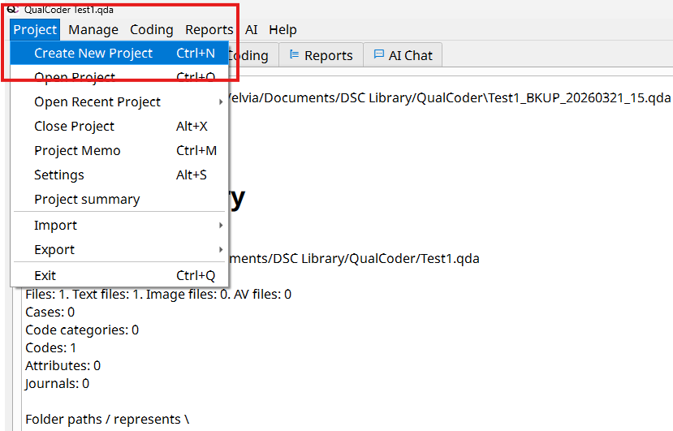
  - In the dialog box:
    - Enter a project name (e.g., “2019 Youth Climate March News Analysis”)
    - Choose a location on your computer to save the project
  - Click **Save**
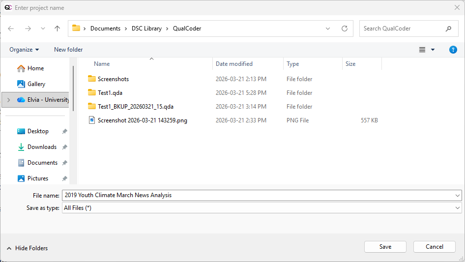

2.	**Navigating the QualCoder Workspace.** Once your project is created, you will see the main QualCoder interface. The workspace is organized into a few key areas that you will use throughout your analysis.
  - **Top Menu Bar.** Located at the top of the screen. Contains key functions such as: 
    - Project management 
    - Importing files 
    - Coding tools 
    - Help 
  - **Main functional tabs.** These tabs allow you to switch between different tasks in QualCoder
    - Located below the top menu bar
  - **Workspace (Main Working Area)**. The central area where your data is displayed 
  - This is where you: 
    - Read your documents
    - Highlight text
    - Apply codes
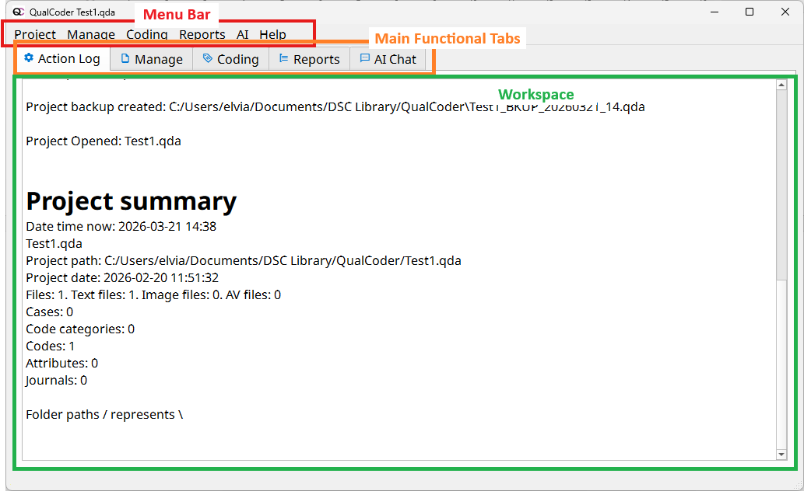

3.	**Importing Text Files into Your Project**
  - Download the two workshop activity files from [this directory](https://bit.ly/DSC_NVIVO_Activity_1_Files){:target="_blank"}
  - From the top menu, click **Manage → Manage Files** 
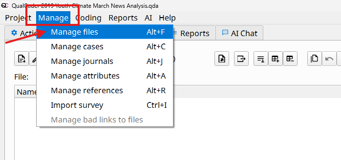
  - In the Manage Files tab, click the **Add File** 
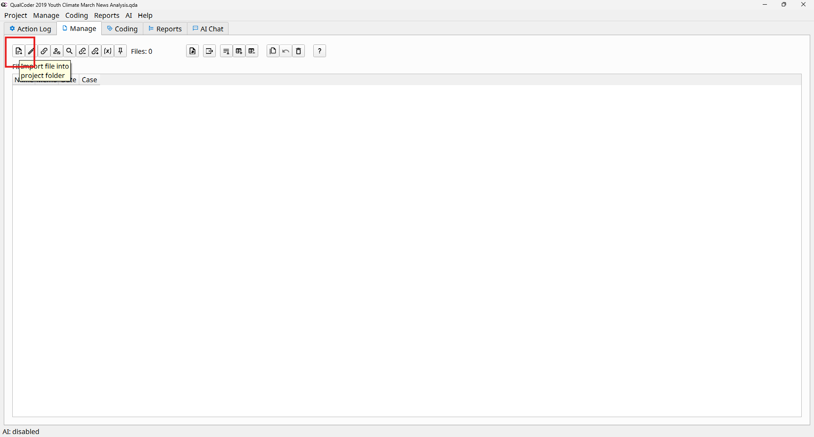
  - Navigate to the two files you downloaded 
  - Select both text files and click **Open** 
  - Click Close to return to the main workspace
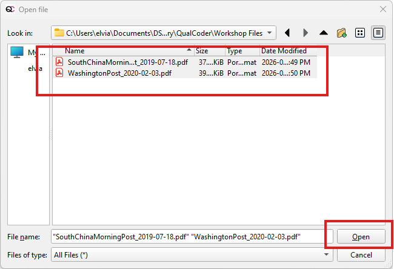

4.	**Viewing Your Imported Files**
  - Your imported files will now appear in the **Files panel **
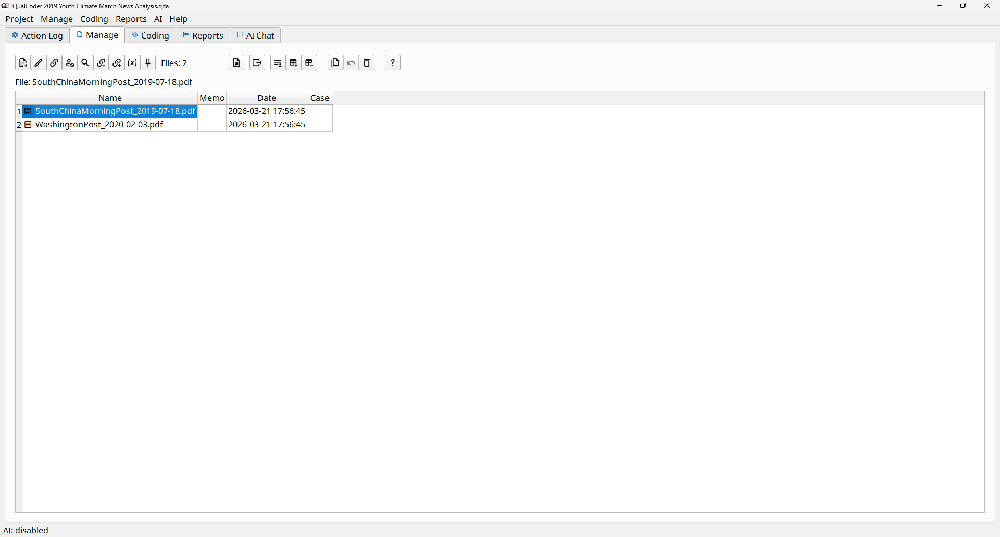
  - Double-click on a file to view or edit it
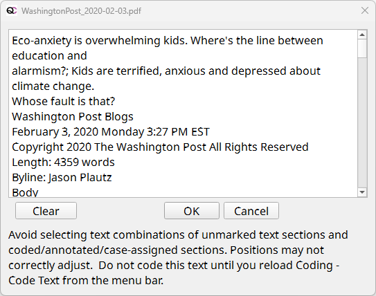

5.	**Working with PDFs in QualCoder**. When you import PDF files into QualCoder, the software automatically converts them into plain text for coding. This allows you to easily highlight and apply codes. However, this can sometimes be confusing because the formatting of the original PDF (e.g., layout, columns, spacing) may not appear exactly the same in the text version.
  - QualCoder also allows you to view the original PDF alongside the extracted text.
  - From the top menu, click **Coding → Code Pdf**
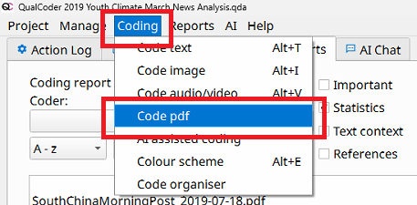
  - Click on one of the pdf files
  - The **PDF view** displays the original document, However, this view is **not editable**
  - The text panel (right side) shows the extracted plain text
  - This is where you can **select text and apply codes**
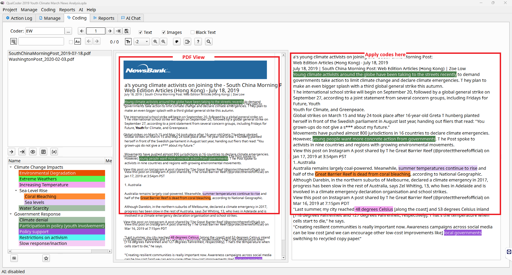

6.	**First Round of Coding**
  - Codes are labels that help you group together pieces of data that relate to the same idea, theme, or concept. When you code text, you are marking sections of your data so they can be easily retrieved and analyzed later.
  - You can code your data in two ways in QualCoder:
    - Code PDF view (**Coding → Code pdf**)
    - Text coding view **(Coding → Code text**)
  - Apply Your First Code (Create a New Code). Read through the document and identify a meaningful sentence or phrase
  - Highlight the text you want to code
  - Right-click on the highlighted text
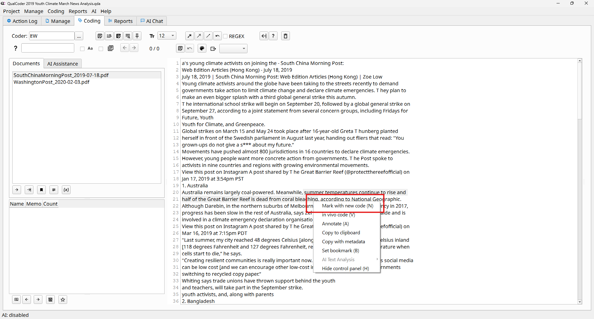
  - Select **Mark with new code (N)**, or press **N** key
  - Enter a name for your code (e.g., “Increasing temperature”)
  - Click **OK**
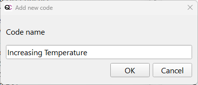
  - Your new code will appear in the Codes panel on the left side of the screen.
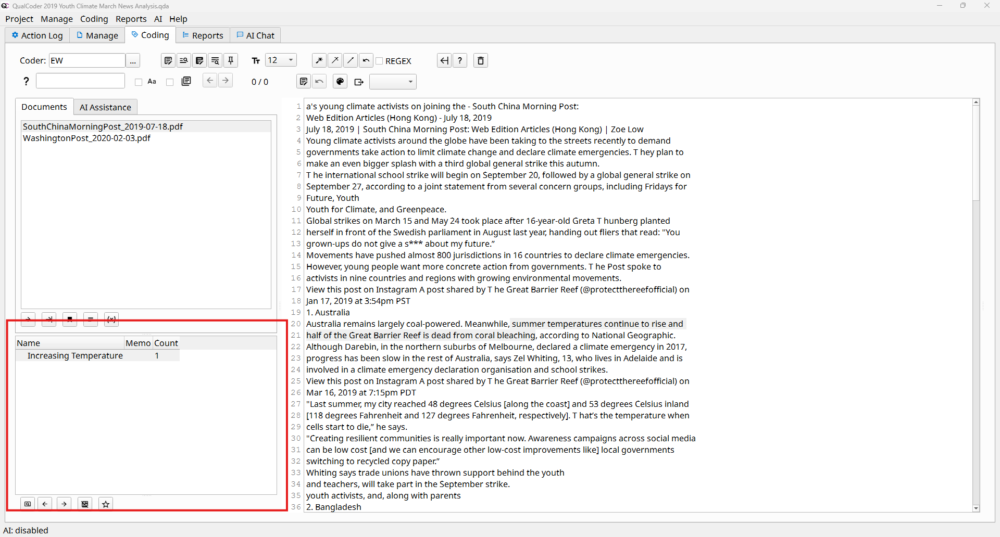

7.	**Apply an Existing Code**
  - Read through the document and identify another relevant sentence or phrase
  - Highlight the text you want to code
  - Right-click on the highlighted text, select **Mark with recent code (R)**
  - Choose the appropriate code from the list (e.g., “Increasing temperature”)
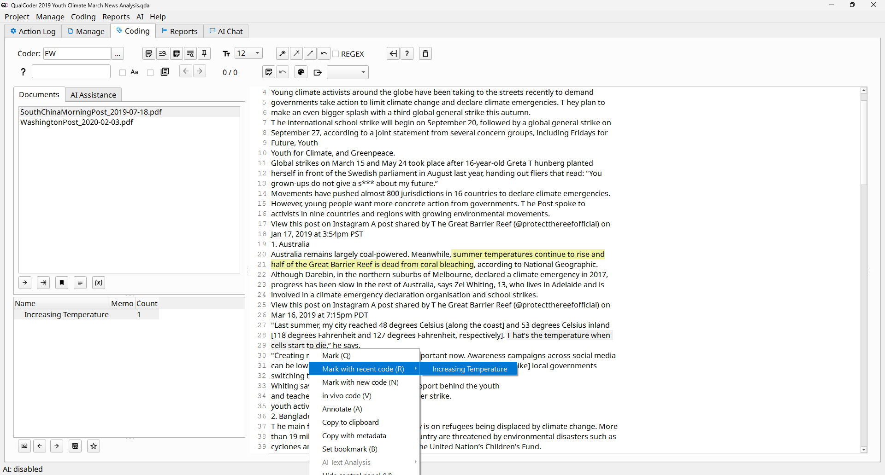

8. As you read through the article, you may notice that some codes are related. For example, increasing temperature can be linked to impacts such as coral bleaching, drought, and extreme weather. In this case, creating a hierarchy (categories) can help you organize related codes into broader themes. This creates a tree-like structure that shows how specific ideas (**codes**) relate to larger concepts (**categories**).
  - In the Coding tab
  - In the bottom-left panel, locate the **Codes section**
  - Right click on any space on the Codes section, click **Add a new category**
  - Enter a category name (e.g., “Climate Change Impacts”)
  - Click **OK**
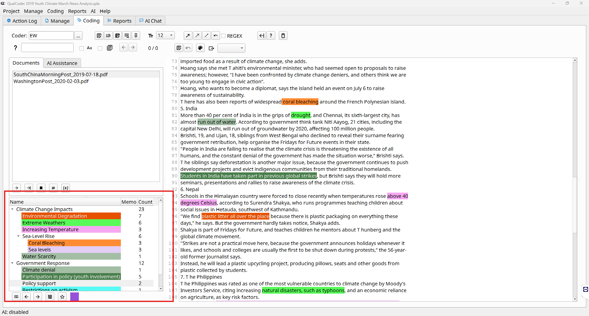
  - **Note**: In QualCoder, categories and codes are separate elements. Codes can be assigned to categories, but they cannot be converted into categories or organized in a parent–child hierarchy like in NVivo.

9. Now continue reading through the document and apply categories and codes to additional sections of text (following **Step 6 - 8**). Do the same for the other pdf. 

